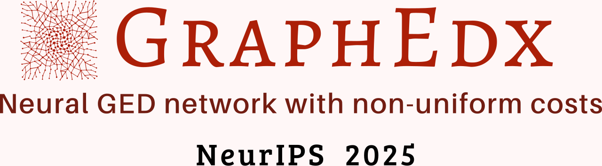

<!DOCTYPE html>
<html lang="en">
<!-- Beautiful Jekyll 6.0.1 | Copyright Dean Attali 2023 -->
<head>
  <meta charset="utf-8">
  <meta name="viewport" content="width=device-width, initial-scale=1, shrink-to-fit=no">

    <link href="http://gmpg.org/xfn/11" rel="profile">
  <meta http-equiv="X-UA-Compatible" content="IE=edge">
  <meta http-equiv="content-type" content="text/html; charset=utf-8">

  <!-- Enable responsiveness on mobile devices-->
  <meta name="viewport" content="width=device-width, initial-scale=1.0, maximum-scale=1">
  <!-- MathJax configuration must come before MathJAX is loaded even if async -->
  

  

  

  

  <title>GraphEdx</title>

  
  
  <meta name="author" content="Dean Attali">
  

  <meta name="description" content="Beautiful Jekyll lets you create a beautiful and simple website in minutes. Perfect for personal blogs or simple project websites.">

  
  <meta name="theme-color" content="#0085A1">
  

  
  <meta name="keywords" content="jekyll,jekyll theme,website theme,website builder,github pages,beautifull jekyll">
  

  
  <link rel="alternate" type="application/rss+xml" title="Beautiful Jekyll" href="https://beautifuljekyll.com/feed.xml">
  

  
<!-- Global site tag (gtag.js) - Google Analytics -->

  

  

  

  

  
    
      
  <link href="https://stackpath.bootstrapcdn.com/bootstrap/4.4.1/css/bootstrap.min.css" rel="stylesheet" integrity="sha384-Vkoo8x4CGsO3+Hhxv8T/Q5PaXtkKtu6ug5TOeNV6gBiFeWPGFN9MuhOf23Q9Ifjh" crossorigin="anonymous">

    
      
  <link rel="stylesheet" href="https://cdnjs.cloudflare.com/ajax/libs/font-awesome/5.12.1/css/all.min.css">

    
      
  <link rel="stylesheet" href="https://fonts.googleapis.com/css?family=Lora:400,700,400italic,700italic">

    
      
  <link rel="stylesheet" href="https://fonts.googleapis.com/css?family=Open+Sans:300italic,400italic,600italic,700italic,800italic,400,300,600,700,800">

    
  

  
    
      <link rel="stylesheet" href="assets/css/bootstrap-social.css">
    
      <link rel="stylesheet" href="assets/css/beautifuljekyll.css">
    
  

  
    
      <link rel="stylesheet" href="assets/css/demo.css">
    
      <link rel="stylesheet" href="assets/css/skin-switch.css">
    
  

  
  
  

  

  
  <meta property="og:site_name" content="Beautiful Jekyll">
  <meta property="og:title" content="Beautiful Jekyll">
  <meta property="og:description" content="Beautiful Jekyll lets you create a beautiful and simple website in minutes. Perfect for personal blogs or simple project websites.">

  
  <meta property="og:image" content="https://beautifuljekyll.com/assets/img/screenshot.png">
  

  
  <meta property="og:type" content="website">
  <meta property="og:url" content="https://beautifuljekyll.com/">
  <link rel="canonical" href="https://beautifuljekyll.com/">
  

  
  <meta name="twitter:card" content="summary_large_image">
  
  <meta name="twitter:site" content="@daattali">
  <meta name="twitter:creator" content="@daattali">

  <meta property="twitter:title" content="Beautiful Jekyll">
  <meta property="twitter:description" content="Beautiful Jekyll lets you create a beautiful and simple website in minutes. Perfect for personal blogs or simple project websites.">

  
  <meta name="twitter:image" content="https://beautifuljekyll.com/assets/img/screenshot.png">
  

  

  

  
  
  <link rel="icon" href="favicon.ico" />
  

  

</head>

<body>
  

 

  <nav class="navbar navbar-expand-xl navbar-light fixed-top navbar-custom top-nav-regular"><button class="navbar-toggler" type="button" data-toggle="collapse" data-target="#main-navbar" aria-controls="main-navbar" aria-expanded="false" aria-label="Toggle navigation">
    
  </button>

  

    <ul class="navbar-nav ml-auto">
          <!----li class="nav-item">
            <a class="nav-link" href="/plans">Plans</a>
          </li>
          <li class="nav-item">
            <a class="nav-link" href="/officehours">Office Hours</a>
          </li---->
          <li class="nav-item dropdown">
            <a class="nav-link dropdown-toggle" href="#" id="navbarDropdown" role="button" data-toggle="dropdown" aria-haspopup="true" aria-expanded="false">Other works</a>
            

                  <a class="dropdown-item" href="/getstarted">IsoNet</a>
                  <a class="dropdown-item" href="/faq">XMCS</a>
                  <a class="dropdown-item" href="/updates">GraphEdX</a>
                  <a class="dropdown-item" href="/examples">FhashNet</a>
            

          </li>
        
          <li class="nav-item">
            <a class="nav-link" href="https://github.com/sponsors/daattali/sponsorships?tier_id=40732">Contact</a>
          </li>
        <li class="nav-item">
          <a class="nav-link" id="nav-search-link" href="#" title="Search">
            
            Search
          </a>
        </li></ul>
  

   

    
  
 
  

</nav>

 

 

<header class="header-section ">

  
  

    

 

        

         <!---img src="assets/img/avatar-icon.png" style="width: 2vw; min-width: 20px;" /----->
          <!----h1>  &nbsp&nbsp &nbsp&nbsp &nbsp&nbsp &nbsp&nbsp &nbsp&nbsp &nbsp&nbsp &nbsp&nbsp Iteratively Refined Early Interaction Alignment   
           &nbsp&nbsp &nbsp&nbsp &nbsp&nbsp &nbsp&nbsp &nbsp&nbsp &nbsp&nbsp &nbsp&nbsp for Subgraph Matching based Graph Retrieval</h1---->
           
           
          <h1>   </h1>
             
             
                  

                

               <a href="TBD"> Eeshaan Jain</a> &nbsp&nbsp Indradyumna Roy &nbsp&nbsp Saswat Meher   
 Soumen Chakrabarti &nbsp &nbsp Abir De 

              

          
          
          
        

      

    

  

  
  

    <a class="btn btn-success btn-lg get-started-btn" href="#">Paper</a>
    <a class="btn btn-primary btn-lg get-started-btn" href="#">Code</a>
    <a class="btn btn-warning btn-lg get-started-btn" href="#">Presentation</a>
        <a class="btn btn-info btn-lg get-started-btn" href="#">Video</a>
  

 

    <a class="btn btn-outline-primary btn-lg get-started-btn" href="#">Definition</a>
     <a class="btn btn-outline-primary btn-lg get-started-btn" href="#">GED with non-uniform costs</a>
    <a class="btn btn-outline-primary btn-lg get-started-btn" href="#">GraphEdx</a>         
        <a class="btn btn-outline-primary btn-lg get-started-btn" href="#">Results</a>         
  

</header>

<main class=" container-md ">
  

    

      

  

<!-- role="list" needed so that `list-style: none` in Safari doesn't remove the list semantics -->
 

      
 
 
        <h2 class="post-title"> Definition of Graph Edit Distance</h2>
 
        
      

        Given two graph \(G\) and \(G'\), the graph edit distance \(\text{GED}(G,G')\) is computed as the total costs of a sequence of edit operations, each from deletion, addition and substitutions of nodes and edges,
        which will convert graph \(G\) into a graph isomorphic to \(G'\). 
        
        $$\text{GED}(G,G')= \min_{\pmb{o} =\{\text{edit}_1,\text{edit}_2,...\}} \sum_{i \in [|\pmb{o}|]} \text{cost}(\text{edit}_i)$$
 
 
 
        
      

      
 

      
\(
   \def\Pb{\pmb{P}}
 \def\Gs{G}
 \def\Gt{G'}
\def\Sb{\pmb{S}}
\def\adjs{\pmb{A}}
\def\adjt{\pmb{A'}}
\def\Perm{\mathbb{P}}
\def\bm{\pmb}
   \def\edel{a_{\ominus}}
\def\ged\{\text{GED}}
 \def\eadd{a_{\oplus}}
  \def\nadd{b_{\oplus}}
   \def\ndel{b_{\ominus}}
      \def\IsValid{\pmb{\eta}}
      \def\Nemb{\bm{X}}
\def\Eemb{\bm{R}}
\def\Deladd{\Delta^{\oplus}}
\def\Delminus{\Delta^{\ominus}}

\def\nembs{\bm{x}}
\def\eembs{\bm{r}}
\def\nembt{\bm{x'}}
\def\eembt{\bm{r'}}
\def\Nembs{\bm{X}}
\def\Eembs{\bm{R}}

\def\Nembt{\bm{X'}}
\def\Eembt{\bm{R'}}
\def\given{\,|\,}
\def\norm#1{\|#1\|_{1,1}}
\def\vecnorm#1{\|#1\|_{1}}
\def\relu#1{\text{ReLU}[#1]}
\def\xorop#1{J\big(#1\big)}

\def\esurr{\Delta^{\bullet} (\Eembs,\Eembt\given \Sb)}

\def\nsurr{\Delta^{\bullet} (\Nembs,\Nembt\given \Pb)}

\def\eaddsurr{\Delta^{\oplus} (\Eembs,\Eembt\given \Sb)}
\def\edelsurr{\Delta^{\ominus} (\Eembs,\Eembt\given \Sb)}
\def\naddsurr{\Delta^{\oplus} (\Nembs,\Nembt\given \Pb)}
\def\ndelsurr{\Delta^{\ominus} (\Nembs,\Nembt\given \Pb)}
      
\)

 
  
        <h2 class="post-title"> GED with non-uniform costs</h2>
 
        
      

Let us consider only for operations: deletion and addition of nodes and edges. Suppose the costs of edge deletion, edge addition, node deletion and node additions are:
 \(a_{\ominus}, a_{\oplus}\), \( b_{\ominus}\), \( b_{\oplus}\), respectively;  adjacency matrices of \(G\) and \(G'\) are  \(\pmb{A}\) and \(\pmb{A'}\), padded with \(N\) nodes. Here,  \(\IsValid_{\Gs}\in \mathbb{R}^N \) denotes the indicator vectors of the non-padded nodes. I.e.,  \(\IsValid_{\Gs}[u]=1, \) if \(u\) is not padded and \(0\), otherwise.
 and, \(\mathbb{P}_N\) is the set of \(N\times N\) permutation matrices. Then    \(\text{GED}(G,G')\) can be written as:  
 
 \begin{align}  \text{GED}(G_1,G_2) =
     \min_{\Pb \in \Perm_N}\,  \frac{a_{\ominus}}{2}  \|\text{ReLU}[\adjs-\Pb \adjt \Pb^{\top}]\|_{1,1} +  \frac{\eadd}{2} \|\text{ReLU}[\Pb \adjt \Pb^{\top}-\adjs]\|_{1,1} \\
   \qquad \qquad \qquad +\ndel \|\text{ReLU}[\IsValid_{\Gs} - \Pb \IsValid_{\Gt}]\|_{1,1}    +\nadd\|\text{ReLU}[\Pb \IsValid_{\Gt} - \IsValid_{\Gs}] .
 \end{align}
 
      

      
  
        <h2 class="post-title"> GraphEdx surrogate</h2>
 
        
      

Minimizing the objective above is a challenging problem.
In similar problems, recent methods have approximated the hard node permutation matrix \(\Pb\) with a soft permutation matrix obtained
 using Sinkhorn iterations on a neural cost matrix. However, the binary nature of the adjacency matrix and the pad indicator \(\IsValid\)  still impede the flow of gradients during training.
 
  
To tackle this problem, we make relaxations in two key places within each term, leading to our proposed model.
  
 (1) We replace the binary values in \(\IsValid_{\Gs}, \IsValid_{\Gt},\adjs\)
 and \(\adjt\) with real values from node and node-pair embeddings: \(\pmb{X} \in \mathbb{R}^{N\times d}\)
 and \(\pmb{R} \in \mathbb{R}^{{N \choose 2} \times D}\). These embeddings are computed using a GNN guided neural module  with parameter \(\theta\). Since the graphs are undirected,  \(\Eemb\) gathers the embeddings of the unique node-pairs, resulting in \({N \choose 2}\) rows instead of \(N^2\).
   
(2) We substitute the hard node permutation matrix \(\Pb\) with a soft alignment matrix, generated using a differentiable alignment planner with parameter \(\phi\). Here, \(\Pb\) is a doubly stochastic matrix, with \(\Pb[u,u']\) indicating the "score" or "probability" of aligning \(u \mapsto u'\). Additionally, we also compute the corresponding node-pair alignment matrix \(\pmb{S}\). 

Using these relaxations, we  approximate the four edit costs in  the above equation with four continuous set distance surrogate functions.  
\begin{align}
 \norm{\relu{\adjs-\Pb \adjt \Pb^{\top}}}\hspace{-1mm}\to \edelsurr,   \\
  \norm{\relu{\Pb \adjt \Pb^{\top}-\adjs}}\hspace{-1mm}\to \eaddsurr,   \\
  {\vecnorm{ \relu{\IsValid_{\Gs} - \Pb \IsValid_{\Gt}}}\to \ndelsurr, \\
\vecnorm{ \relu{\Pb \IsValid_{\Gt} - \IsValid_{\Gs}}} \to \naddsurr .} 
\end{align}
This gives us an approximated GED parameterized by \(\theta\) and \(\phi\).
\begin{equation}
\begin{split}
    \ged_{\theta,\phi}(\Gs,\Gt) &= \edel\edelsurr+\eadd\eaddsurr \\ 
&+ \ndel\ndelsurr+\nadd\naddsurr.\label{eq:ged-theta-phi}
\end{split}
\end{equation}

 
 
 \(
 \def\mms{\text{DiffAlign}}

\def\msm{\text{AlignDiff}}

\def\xor{\text{XOR-}\mms}

\def\mmsShort{\text{DA}}

\def\msmShort{\text{AD}}

\def\xorShort{\text{XOR}}

\)
 
 
 
  
  
 
 
Next, we propose three types of neural surrogates to approximate each of the four operations. 

 
 

(1) \(\msm\): Given the node-pair embeddings \(\Eembs\) and \(\Eembt\) for the graph pairs \(\Gs\) and \(\Gt\), we apply the soft node-pair alignment \(\Sb\) to \(\Eembt\). We then define the
edge edits 
in terms of asymmetric differences between \(\Eembs\) and \(\Sb \Eembt\). We write \(\edelsurr\) and \(\eaddsurr\) as:
\begin{align}
    \edelsurr=\norm{\relu{\Eembs-\Sb\Eembt}},   \quad   \eaddsurr=\norm{\relu{\Sb\Eembt-\Eembs}}. \label{eq:msm-edge}
\end{align}
Similarly, for the node edits,  we can compute \(\ndelsurr\) and \(\naddsurr\) as:
\begin{align}
\ndelsurr=\norm{\relu{\Nembs-\Pb\Nembt}},   \quad   \naddsurr=\norm{\relu{\Pb\Nembt-\Nembs}}. \nonumber
\end{align}

(2) \(\mms\): We first aligned \(\Eembt\) using \(\Sb\) and then computed the difference from \(\Eembs\). Instead, here we first computed the pairwise differences between \(\Eembt\) and \(\Eembs\) for all pairs of node-pairs (\(e,e'\)), and then combine these differences with the corresponding alignment scores \(\Sb[e,e']\). We compute the edge edit surrogates \(\edelsurr\) and \(\eaddsurr\) as:
\begin{align}
    \edelsurr=\sum_{e,e'}\left\|\relu{\Eembs[e,:]-\Eembt[e',:]}\right\|_1 \Sb[e,e'],  \label{eq:edge-mms-1} \\
\eaddsurr=\sum_{e,e'}\left\|\relu{\Eembt[e',:]-\Eembs[e,:]}\right\|_1 \Sb[e,e'].   \label{eq:edge-mms-2}
\end{align}
Here, \(e\) and \(e'\) represent node-pairs, which are not necessarily edges. When the node-pair alignment matrix \(\Sb\) is a hard permutation, \(\Delta^{\oplus}\) and \(\Delta^{\ominus}\)  remain the same across \(\msm\) and \(\mms\). Similarly, we can compute \(\ndelsurr= \sum_{u,u'}\left\|\relu{\Nembs[u,:]-\Nembt[u',:]}\right\|_1 \Pb[u,u']\) and \(\naddsurr=\sum_{u,u'}\left\|\relu{\Nembt[u',:]-\Nembs[u,:]}\right\|_1 \Pb[u,u']\).
 
  
 
 (3) \(\xor\):   As indicated by the combinatorial formulation of GED, the edit cost of a particular node-pair is non-zero only when an edge is mapped to a non-edge or vice-versa. However, the surrogates for the edge edits in \(\msm\) or \(\mms\) fail to capture this condition because they can assign non-zero costs to the pairs \((e=(u,v),e'=(u',v'))\) even when both \(e\) and \(e'\) are either edges or non-edges.
To address this, 
we explicitly applya XOR operator \(\xorop{\cdot,\cdot}\) between the corresponding entries in the adjacency matrices, \ie, \(\adjs[u,v]\) and \(\adjt[u',v']\). and then multiplying this result with the 
underlying term. Hence, we write: 
\begin{align}
 \hspace{-2mm}   \edelsurr & =\sum_{\substack{e=(u,v) \\ e'=(u',v')}}\xorop{\adjs[u,v],\adjt[u',v']}\left\|\relu{\Eembs[e,:]-\Eembt[e',:]}\right\|_1 \Sb[e,e'], \label{eq:xor-1}  \\ 
  \hspace{-2mm}  \eaddsurr & =\sum_{\substack{e=(u,v) \\ e'=(u',v')}}\xorop{\adjs[u,v],\adjt[u',v']}\left\|\relu{\Eembt[e',:]-\Eembs[e,:]}\right\|_1 \Sb[e,e'].   \label{eq:xor-2}
\end{align}
Similarly, the cost contribution for node operations arises from mapping a padded node to a non-padded node or vice versa. We account for this by multiplying  \)J(\IsValid_{\Gs}[u], \IsValid_{\Gt}[u'])\) with each term of \(\ndelsurr\) and \(\naddsurr\) computed using \mms. 
Hence, we compute
\(\ndelsurr= \sum_{u,u'} J(\IsValid_{\Gs}[u], \IsValid_{\Gt}[u']) \left\|\relu{\Nembs[u,:]-\Nembt[u',:]}\right\|_1 \Pb[u,u']\) and \(\naddsurr=\sum_{u,u'}J(\IsValid_{\Gs}[u], \IsValid_{\Gt}[u'])\left\|\relu{\Nembt[u',:]-\Nembs[u,:]}\right\|_1 \Pb[u,u']\). 
      

      
 
 
  
 
       

      

      

 
        <h2 class="post-title">Results </h2>
 
        TBD
 
     

</body>
</html>

